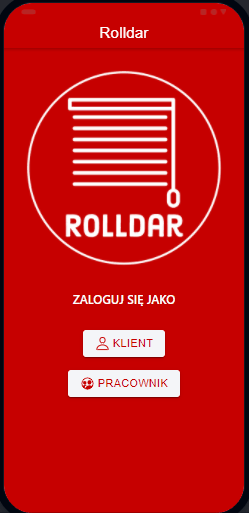

# Rolldar

## Spis treści
* [Informacje wstępne](#Informacje-wstępne)
* [Technologie i narzędzia](#Technologie-i-narzędzia)
* [Funkcjonalności](#Funkcjonalności)
* [Interfejs](#Interfejs)
* [Uruchomienie projektu](#Uruchomienie-projektu)

## Informacje wstępne
Hybrydowa aplikacja mobilna stworzona z wykorzystaniem frameworka Ionic.

Przeznaczona dla pracowników oraz dla klientów firmy Rolldar System zajmującej się dekoracjami okiennymi.
Apikacja umożliwia klientom przegląd oferty tego przedsiębiorstwa, wgląd w galerię dotychczas zrealizowanych 
zleceń oraz złożenie zamówienia na usługę. Pracownik ma możliwość zarządzania zamówieniami, może nadawać im statusy 
oraz może przechowywać w aplikacji zdjęcia faktur.

## Technologie i narzędzia

| ID | Nazwa | Zastosowanie | Wersja |
| ------- | -------|------|------| 
| 1 | Visual Studio Code | Środowisko programistyczne | - |
| 2 | Ionic Framework | - | 5.4.1 |
| 3 | Angular | -  | 10.2.0 |
| 3 | AngularFire |  | 6.0.3 |
| 4 | Typescript | - |  4.0.3 |
| 5 | Firebase | - |  7.24.0 |
| 6 | HTML5 | - |  7.24.0 |
| 7 | Figma | Stworzenie prototypu aplikacji |  - |

## Funkcjonalności

| ID | Kategoria | Podkategoria | Nazwa krótka | Opis | Priorytet |
| ------- | -------|------|------| -----| ----- |
| 1 | Funkcjonalne | Logowanie | Tworzenie konta| Użytkownik może założyć nowe konto w aplikacji jako klient po podaniu w odpowiednim formularzu swojego imienia, nazwiska, adresu email oraz hasła |1|
| 2 | Funkcjonalne | Logowanie | Walidacja rejestracji | Jeśli użytkownik podczas wypełniania formularza rejestracji poda dane w nieodpowiednim formacie, lub będzie chciał użyć istniejącego w bazie adresu email informacja o tym zostanie wyświetlona pod formularzem| 1 |
| 3 | Funkcjonalne | Logowanie | Przekierowanie po rejestracji | Użytkownik po udanym utworzeniu konta zostanie przekierowany na stronę z ofertą firmy Rolldar | 2 |
| 4 | Funkcjonalne |Logowanie| Logowanie klienta | Użytkownik może zalogować się do aplikacji na wcześniej założone konto po podaniu poprawnego adresu email oraz hasła| 1 |
| 5 | Funkcjonalne |  Logowanie | Walidacja logowania klienta| Jeśli użytkownik podczas próby logowania poda nieprawidłowe hasło lub adres email informacja o tym zostanie wyświetlona pod formularzem| 1 |
| 6 | Funkcjonalne | Logowanie | Przekierowanie po logowaniu | Użytkownik po udanym zalogowaniu zostanie przekierowany na stronę z ofertą firmy Rolldar | 2 |
| 7 | Funkcjonalne |Logowanie | Odzyskiwanie hasła | Użytkownik podając swój adres email w odpowiednim miejscu może wygenerować mail, który będzie zawierał link do formularza umożliwiającego zmianę hasła, jeśli podany email nie znajduje się w bazie zostanie wyświetlony stosowny komunikat | 2 |
| 8 | Funkcjonalne | Logowanie | Strona główna | Po wejściu do aplikacji użytkownik zostaje przekierowany na stronę główną, na której znajduje się logo firmy oraz dwa przyciski - jeden przekierowuje do strony logowania dla pracowników, a drugi do strony logowania dla klientów | 1 |
| 9 | Funkcjonalne | Logowanie | Logowanie pracownika | Użytkownik znajdujący się na stronie zawierającej formularz logowania dla pracowników po wpisaniu prawidłowo loginu oraz hasła zostaje przekierowany do strony "Panel pracownika" | 1  |
| 10 | Funkcjonalne | Logowanie | Walidacja logowania pracownika | Użytkownik znajdujący się na stronie zawierającej formularz logowania dla pracowników po wpisaniu nieprawidłowych danych w formularzu zostaje o tym poinformowany poprzez wyświetlenie stosownego komunikatu | 1 |
| 11 | Funkcjonalne | Oferta | Widok oferty| Użytkownik ma możliwość przeglądania oferty firmy Rolldar poprzez widok strony "Oferta", która zawiera wszystkie dostępne rodzaje dekoracji okien| 1 |
| 12 | Funkcjonalne | Oferta | Wyszukanie oferty| Poprzez pasek wyszukiwania znajdujący się na górze strony "Oferta" użytkownik ma możliwość wyszukania interesującego go elementu z oferty firmy| 3 |
| 13 | Funkcjonalne | Oferta | Szczegóły oferty | Użytkownik po kliknięciu na dany rodzaj dekoracji okiennej na stronie "Oferta" zostanie przeniesiony do strony zawierającej szczegółowe informacje oraz galerie zdjęć wybranej przez siebie opcji| 2 |
| 14 | Funkcjonalne | Oferta | Karuzela ze zdjęciami | Użytkownik na stronie ze szczegółami oferty widzi galerię zdjęć, które automatycznie się przewijają, ale może także przeglądać je samodzielnie poprzez nawigację w lewo lub w prawo| 3 |
| 15 | Funkcjonalne | Menu | Wyświetlenie bocznego menu | Użytkownik poprzez naciśnięcie przycisku menu znajdującego się w lewym górnym rogu aplikacji otwiera panel menu wyświetlający się po prawej stronie aplikacji | 1 |
| 16 | Funkcjonalne | Menu | Zawartość bocznego menu | Poprzez naciśnięcie na jedną z zakładek znajdującego się w bocznym menu: 'Oferta', 'Rezerwuj usługę' oraz 'Wyloguj się' użytkownik zostaje odpowiednio przekierowany do strony z ofertą, rezerwacją lub po wylogowaniu do strony głównej aplikacji | 1  |
| 17 | Funkcjonalne | Rezerwacja | Dokonanie rezerwacji | Użytkownik poprzez poprawne wypełnienie formularza rezerwacji ma możliwość umówienia się na wykonanie usługi przez firmę Rolldar, po udanej rezerwacji wyświetlone zostaje okno informujące o powodzeniu  | 1 |
| 18 | Funkcjonalne | Rezerwacja | Formularz rezerwacji | Użytkownik wypełnia poprawnie formularz poprzez podanie swojego: imienia i nazwiska, adresu email, numeru telefonu, adresu zamieszkania oraz po wybraniu intereującej go usługi, rodzaju rolet, dnia, oraz godziny od której i do której ma czas na daną usługę, jeśli podane dane będą nieprawidłowe pojawi się stosowny komunikat  | 1 |
| 19 | Funkcjonalne | Zamówienia | Lista zamówień |  Użytkownik zalogowany jako pracownik znajdując się na stronie "Zamówienia" wyświetla listę zamówień złożonych przez klientów - widoczne jest imię i nazwisko osoby zamawiającej oraz status zamówienia | 1 |
| 20 | Funkcjonalne | Zamówienia | Usuwanie zamówienia | Użytkownik zalogowany jako pracownik znajdując się na stronie "Zamówienia" po naciśnięciu na ikonę kosza znajdującą się przy danym zamówieniu z listy ma możliwość usunięcia wszystkich informacji o danym zamówieniu z bazy. Po naciśnięciu ikony wyświetla się okno, które prosi użytkownika o potwierdzenie swojej decyzji  | 2  |
| 21 | Funkcjonalne | Zamówienia | Szczegóły zamówienia | Użytkownik zalogowany jako pracownik znajdując się na stronie "Zamówienia" po naciśnięciu na ikonę z ołówkiem znajdującą się przy danym zamówieniu z listy zostaje przekierowany na stronę zawierającą szczegóły danego zamówienia  | 1 |
| 22 | Funkcjonalne | Zamówienia | Edycja zamówienia | Użytkownik zalogowany jako pracownik znajdując się na stronie zawierającej szczegóły danego zamówienia może edytować umieszczone tam dane, w tym zmieniać status zamówienia. Dostępne statusy: "Nowy", "W realizacji", "Ukończono"   | 2 |
| 23 | Funkcjonalne | Zamówienia | Walidacja edycji zamówienia | Użytkownik zalogowany jako pracownik znajdując się na stronie zawierającej szczegóły danego zamówienia może dokonać edycji danych tylko jeśli poprawnie przejdzie walidację wprowadzonych zmian  | 3 |
| 24 | Funkcjonalne | Zamówienia | Sortowanie zamówień | Użytkownik zalogowany jako pracownik znajdując się na stronie "Zamówienia" poprzez naciśnięcie i przytrzymanie ikony znajdującej się po lewej stronie danego zamówienia ma możliwość zmiany kolejności zamówień na liście| 3 |
| 25 | Funkcjonalne | Zamówienia | Wyszukiwanie zamówień | Użytkownik zalogowany jako pracownik znajdując się na stronie "Zamówienia" poprzez wpisanie interesującej go frazy w pasku wyszukiwania na górze strony ma możliwość wyszukanie zamówień, które zawierają wpisane słowa|  |
| 26 | Funkcjonalne | Faktury | Lista faktur | Użytkownik zalogowany jako pracownik znajdując się na stronie "Faktury" ma możliwość przeglądania listy dodanych zdjęć faktur - wyświetla się nazwa oraz miniaturka zdjęcia każdej z faktur| 3 |
| 27 | Funkcjonalne | Faktury | Dodanie zdjęcia faktury | Użytkownik zalogowany jako pracownik znajdując się na stronie "Faktury" po naciśnięciu przycisku "Wybierz plik" ma możliwość wgrania na listę faktur zdjęcie w formacie .png lub .jpg poprzez wybranie go z urządzenia | 3 |
| 28 | Funkcjonalne | Faktury | Pobranie zdjęcia | Użytkownik zalogowany jako pracownik znajdując się na stronie "Faktury" po naciśnięciu ikony pobierania znajdującej się pod każdym ze zdjęć na liście ma możliwość wyświetlenia zdjęcia w pełnym formacie i pobrania go na swoje urządzenie | 3 |
| 29 | Funkcjonalne | Panel pracownika | Widok panelu pracownika | Użytkownik zalogowany jako pracownik znajdujący się na stronie "panel pracownika" widzi dwa przyciski, które po naciśnięciu przekierują go odpowiednio: pierwszy "zamówienia" - do strony zawierającej listę zamówień, drugi "faktury" - do strony zawierającej listę faktur | 1 |

## Interfejs

1 i 5 funkcjonalność - tworzenie konta i walidacja rejestracji

 

2, 4 i 6 funkcjonalność - logowanie klienta, walidacja logowania i przekierowanie po logowaniu

 

3 funkcjonalność - odzyskiwanie hasła i komunikat błędu

 

## Uruchomienie

